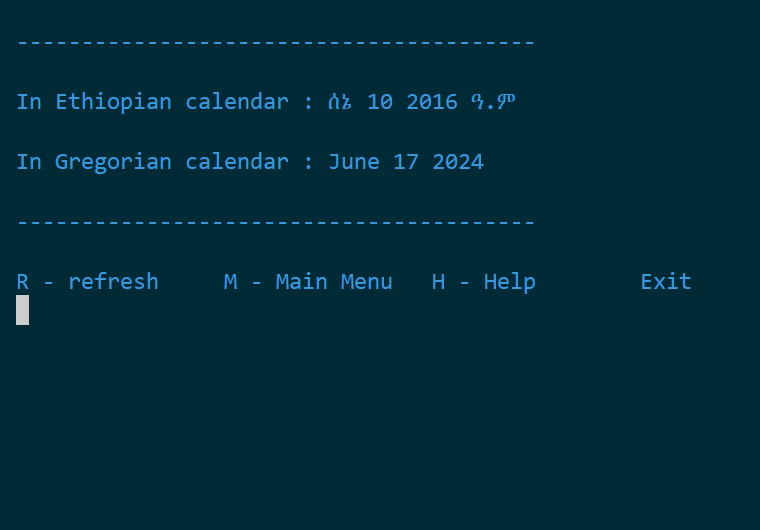
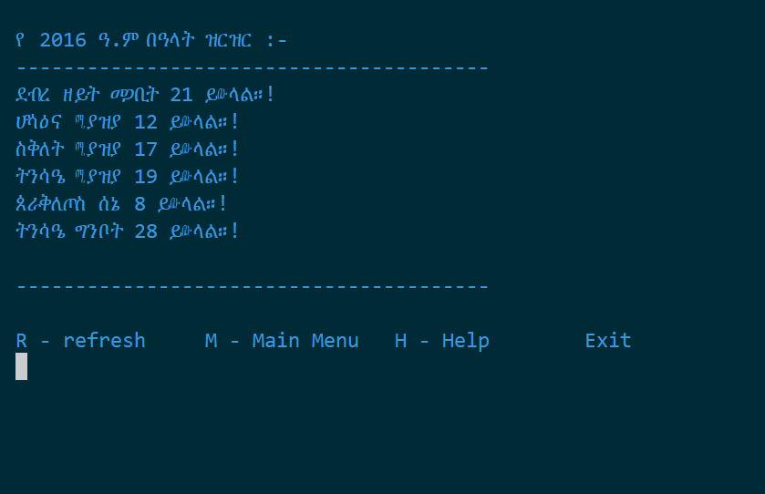
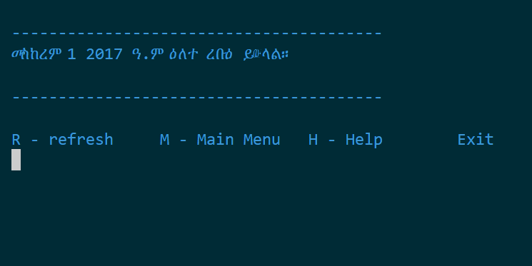

# C++ Calendar Console App

## Overview

This C++ console application provides a set of features for working with both Ethiopian and Gregorian calendars. It includes functionalities like monthly calendar display, date conversion, holiday and fasting date calculations, and finding the weekday for any given date.

## Features

- **Monthly Calendar Display**: View monthly calendars for both Ethiopian and Gregorian calendar systems.
- **Date Conversion**: Convert dates between Ethiopian and Gregorian calendars.
- **Holiday & Fasting Calculation**: Calculate the dates for holidays and fasting periods for any given year.
- **Weekday Finder**: Determine the weekday for any given date.

## Getting Started

### Prerequisites

To compile and run this application, you need:

- A C++ compiler (e.g., GCC, Clang, or MSVC)
- A terminal or command prompt

### Installation

1. **Clone the repository**:
    ```bash
    git clone https://github.com/haileamlak/bahire-hasab-calendar-app.git
    cd bahire-hasab-calendar-app
    ```

2. **Compile the program**:
    ```bash
    g++ -o calendar-app main.cpp
    ```

3. **Run the program**:
    ```bash
    ./calendar-app
    ```
## Visuals

<table>
  <tr>
  </tr>
  <tr>
    <td></td>
    <td></td>
    <td></td>
  </tr>

  <tr>
    <td></td>
    <td></td>
    <td></td>
  </tr>

  <tr>
    <td></td>
    <td></td>
    <td></td>
  </tr>
  
  <tr>
    <td></td>
  </tr>
</table>
